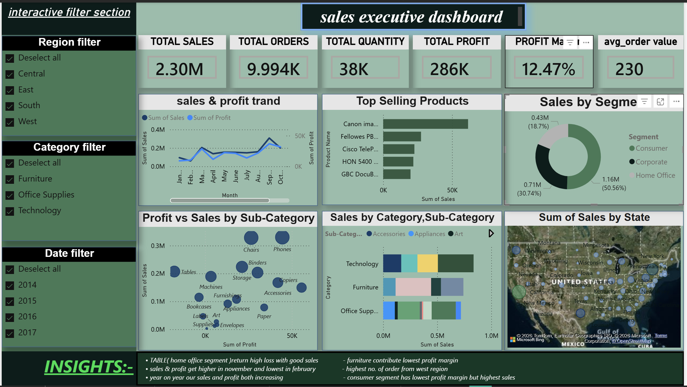
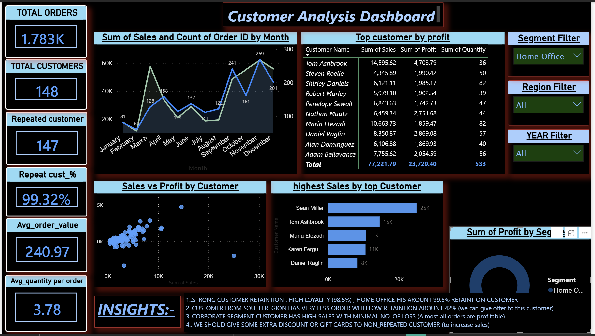

# PowerBI-SuperStore-Analysis

## Project Overview

This project presents an interactive Power BI dashboard built using the Sample Superstore dataset. The dashboard helps analyze sales performance, profitability, customer trends, regional performance, and the impact of discounts on business outcomes.

## Tools Used

- Power BI
- Power Query
- DAX
- Sample Superstore Dataset

## Dashboard Pages

### 1. Sales Overview
- Total Sales
- Total Profit
- Total Orders
- profit margin
- Sales Trend Analysis
- Category-wise Performance
- Segment-wise Performance

### 2. customer Analysis
- total customer
- Repeted customer %
- avg quantity / order
- Profit by segment
- top customer by profit
- sales vs Profit Analysis
- no. of order trand

### 3. Risk managment analysis
- total loss
- avg loss
- no. of loss order
- Discount vs Loss analysis
- loss trand analysis
- loss by ship mode analysis
- loss by sub_category 

## Key KPIs

- Total Sales
- Total Profit
- Total Orders
- Total loss
- Average loss
- Average discount 
- Profit Margin
- repeated customer %

## Key Insights

- consumer segment generated the highest sales.
- Higher discounts often reduced profitability.
- Some sub-categories generated high sales but low profit  (like- tables,bookcase,etc).
- Regional performance varied significantly across states.
- Profitability depends on both sales volume and discount strategy.
- standerd class ship mode making highest loss (we can chsange ode of shiping)

## Dashboard Screenshots

### Sales Overview

### customer Analysis

### Rish&Loss managment analysis

## Files Included

- Superstore_Sales_Analysis.pbix
- Sample_Superstore.csv
- Dashboard Screenshots
- README.md

## Author

Amarjeet
Aspiring Data Scientist | Data Analytics & Business Intelligence
