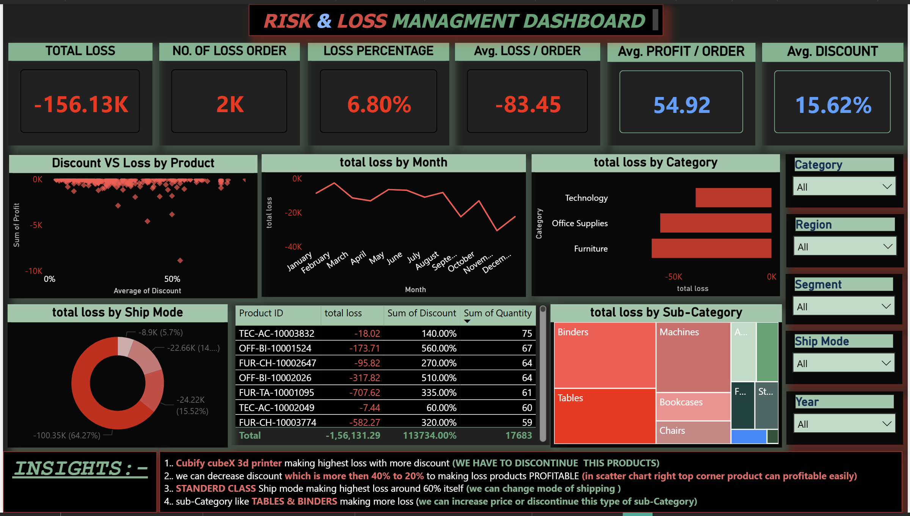

# Power BI Superstore Analysis Dashboard

## Project Overview

This project presents an interactive Power BI dashboard built using the Sample Superstore dataset. The dashboard analyzes sales performance, profitability, customer behavior, and loss-making areas to support data-driven business decisions.

## Tools Used

- Power BI
- Power Query
- DAX
- Sample Superstore Dataset

## Dashboard Pages

### 1. Sales Overview

- Total Sales
- Total Profit
- Total Orders
- Profit Margin
- Sales Trend Analysis
- Category-wise Performance
- Segment-wise Performance

### 2. Customer Analysis

- Total Customers
- Repeated Customer Percentage
- Average Quantity per Order
- Profit by Segment
- Top Customers by Profit
- Sales vs Profit Analysis
- Order Trend Analysis

### 3. Risk Management Analysis

- Total Loss
- Average Loss
- Number of Loss-Making Orders
- Discount vs Loss Analysis
- Loss Trend Analysis
- Loss by Ship Mode Analysis
- Loss by Sub-Category

## Key KPIs

- Total Sales
- Total Profit
- Total Orders
- Total Loss
- Average Loss
- Average Discount
- Profit Margin
- Repeated Customer Percentage

## Key Insights

- The Consumer segment generated the highest sales.
- Higher discounts often reduced profitability.
- Some sub-categories generated high sales but low profit, such as Tables and Bookcases.
- Performance varied significantly across regions and states.
- Profitability depends on both sales volume and discount strategy.
- Standard Class shipping mode contributed the highest overall loss, indicating an opportunity to optimize shipping strategies.

## Dashboard Screenshots

### Sales Overview

### customer Analysis

### Risk&Loss managment analysis

## Files Included

- Superstore_Sales_Analysis.pbix
- Sample_Superstore.csv
- Dashboard Screenshots
- README.md

## Author

Amarjeet
Aspiring Data Scientist | Data Analytics & Business Intelligence
